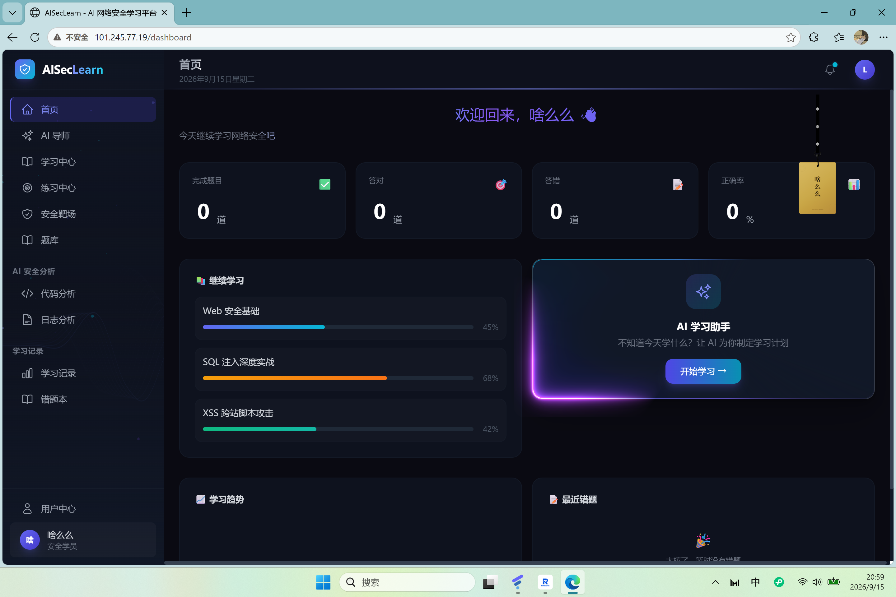

# AISecLearn

一个 AI + 网络安全学习平台。说是"平台"，其实就是我们三个人想把平时学的安全知识、做过的题、踩过的坑，做成一个能真正用起来的东西——而不是又一个只会聊天的 AI 网页。

在线地址：http://101.245.77.19



## 这东西能干嘛

登录之后，主要就是几件事：

**跟 AI 导师学。** 这是整个项目的核心。它不像那种一问一答的机器人，而是会记着你学到哪了。打开对话，它会先跟你说"你上次学 SQL 注入，布尔盲注那块好像没太扎实，今天接着补还是往下学？"——这是我们在 System Prompt 上花了不少时间调出来的效果。

**做题，然后让 AI 批改。** 题库里是安全选择题，选完提交，AI 不只是判对错，还会讲为什么。答错的题自动进错题本。

**看代码有没有漏洞。** 贴一段代码进去，AI 会把里面的安全问题挑出来——是 SQL 注入还是命令拼接，在第几行，怎么改。这个功能算是我们平台的一个小特色：我们本身是教安全的，那先拿自己的代码开刀。

**分析日志。** 贴服务器日志，先过一个本地的规则引擎（几毫秒出结果，能认暴力破解、注入尝试、敏感文件扫描），再交给大模型做更细的分析。两层配合，比单纯丢给 AI 靠谱。

另外还有课程列表、学习记录（真实的答题统计，不是写死的数字）、个人中心，以及一个只有管理员能进的后台。

## 用了什么

前端是 React 18 + Vite + Tailwind，UI 上我们大量用了 [React Bits](https://reactbits.dev) 这个动画组件库——粒子背景、聚光灯卡片、3D 吊牌这些都是它提供的，省了自己从头写动画的功夫。

后端是 FastAPI + SQLAlchemy，认证用 JWT，密码 bcrypt 加密。数据库开发时用 SQLite，生产环境准备了 MySQL 的建表脚本。

部署在一台华为云 Ubuntu 服务器上，Nginx 托管前端静态文件并反向代理 API，后端用 systemd 做成系统服务，开机自启。

## 关于安全

既然是做安全平台，自己要是被一个 F12 就扒光了，那就有点尴尬。所以有些地方是特意处理过的：

最早 AI 功能是前端直接调 DeepSeek 的，API Key 直接写在前端代码里——这等于把钥匙贴在门上，任何人打开浏览器控制台都能看到。后来改成了后端代理：前端只带 JWT 请求我们自己的后端，后端拿到请求再用服务器上的 Key 去调 DeepSeek。Key 只存在服务器的环境变量里，永远不下发到浏览器。

其他的：受保护接口都校验 JWT；密码 bcrypt 加盐哈希（不存明文）；每个人的学习记录按用户 ID 隔离，互相看不到；后台接口会检查是不是管理员，不是就返回 403；数据库操作全部走 ORM 参数化查询，不拼 SQL；练习模式的题目接口会藏掉正确答案，防止有人直接抓答案。

## 怎么跑起来

需要 Node.js 18+ 和 Python 3.10+。

前端：

```bash
npm install
npm run dev
```

后端：

```bash
cd backend
python -m venv venv
source venv/bin/activate     # Windows 用 venv\Scripts\activate
pip install -r requirements.txt

# 配上 DeepSeek Key
$env:DEEPSEEK_API_KEY="sk-你的key"

python main.py
```

跑起来后 `http://localhost:8000/docs` 是 FastAPI 自动生成的接口文档，可以直接在那儿测试。

想把某个账号设成管理员：

```bash
cd backend
python make_admin.py 用户名
```

## 目录结构

```
AISecLearn/
├── src/                  前端
│   ├── components/
│   │   ├── layout/       侧边栏、顶栏
│   │   └── react-bits/   React Bits 组件
│   ├── pages/            各个页面
│   ├── router/           路由和登录守卫
│   ├── services/         接口封装 / AI 代理
│   └── utils/            Prompt、日志规则
├── backend/              FastAPI 后端
│   ├── main.py           接口
│   ├── models.py         数据表模型
│   ├── auth.py           JWT、密码哈希
│   └── schema.sql        MySQL 建表
├── security/             安全内容
│   ├── knowledge_base/   15 类漏洞知识库
│   ├── code_analysis/    代码审计规则
│   └── lab/              靶场设计
└── docs/                 设计文档
```

## 谁做的

三个人分工，中间互相搭手。

- **李欣键**（人工智能）— 前端全部页面、AI 功能、UI、部署
- **邓倬言**（电子与计算机工程）— 后端接口、数据库
- **刘梓欣**（网络安全）— 漏洞知识库、代码审计规则、靶场

协作走的是 GitHub 正常流程：`main` 是稳定分支，每个人有自己的开发分支（`dev/frontend`、`dev/backend`、`dev/security`），main 设了保护，代码必须走 Pull Request 合并。任务用 Issues 跟踪。

## License

MIT
